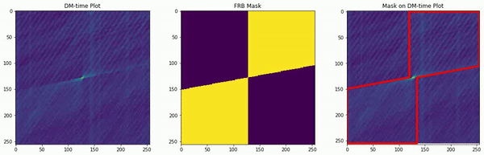
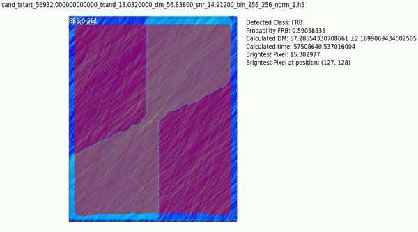

# FABLE
Fast rAdio Burst Localization &amp; dEtection using Mask-RCNN

Automatic Annotation of Single Pulse or Fast Radio Burst Candidate
---
The steps and codes to perform an automatic annotation of single pulse is detailed below. An illustration of masking and annotation is shown here.

Prediction of test data using trained FABLE model
---

An illustration of prediction on a sample of test data is illustrated below. The code in this directory perform detection and localization of FRB and background noise only. However, the FABLE code can be adapted such that it detect and localise three class scenario: FRB, RFI and Background as illustrated here.

Set up the Environment
---
- Create a Virtual environment using conda

         Create virtual environment: conda create -n frbloc python==3.6

- Activate the environment

        source activate frbloc or conda activate frbloc
       
- Install tensorflow and keras 

        pip3 install tensorflow-gpu==1.14
        pip3 install keras==2.1.0
        
- Install all required packages as follows

        pip3 install numpy scipy Pillow cython matplotlib scikit-image opencv-python h5py imgaug Ipython
        
- If jupyter can’t find the tensorflow and jupyter is not working, on terminal type

        pip3 install jupyter notebook==4.3.0
        python -m ipykernel install --user —name=frbloc
        
- Then in Jupyter notebook choose frbloc kernel.

How to run AUTOMATIC ANNOTATION FOR Fast Radio Burst Candidates
---
- TO RUN MASKING

        cd FABLE/samples/FRB/automated_mask_code/
        
- Split data into training, validation and test set. Run jupyter notebook

        Step2-split-data-into-training-test-set.ipynb

- Automatic Annotation, run jupyter notebook

        Step3-automated_masking-without-plotting.ipynb or Step3-automated_masking.ipynb   
        
- Inspect whether the annotation is correct or not and run the jupyter notebook

         cd FABLE/samples/FRB/
         Stage 1- INSPECT-FRB-DATA.ipynb

        
How to train FABLE model from scratch
---

         cd FABLE/samples/FRB/
         
- To train the model, we use SP_SingleClass.py. This code detctect only FRB/Single pulse from the background noise.

         python SP_SingleClass.py train --dataset=/home/hosenie/Desktop/FABLE/samples/FRB/automated_mask_code/fetch_data --weights=coco
         
Make preeiction with the trained model
---
- Step by step training process and prediction

         cd FABLE/samples/FRB/
         Stage 2 - Demo-FABLE-stages.ipynb
         
- Make prediction on validation and test set. Compute the DM and time of the pulse based on the mask.

         cd FABLE/samples/FRB/
         Stage 3 - PREDICTION-OF-FRB-IN-TEST-SET.ipynb

## Citing this work
___

If you use this work please cite:

    @software{zafiirah_hosenie_2020,
      author       = {Zafiirah Hosenie},
      title        = {{Zafiirah13/FABLE/: Software release}},
      month        = September,
      year         = 2020,
      publisher    = {Github},
      version      = {0.1},
      url          = {https://github.com/Zafiirah13/FABLE/}
    }
